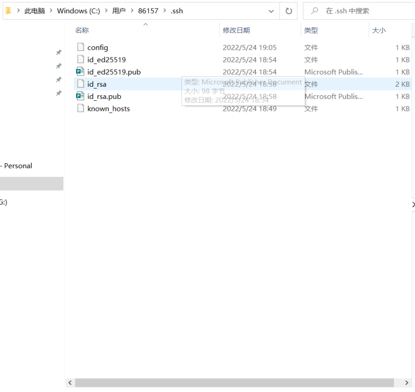

#  git如何进行ssh的配置

## git相关命令

1. git init #初始化仓库
2. git pull origin master –allow-unrelated-histories # 首先将远程仓库master的文件pull下来git 
3. git add . #把我们要提交的本地文件添加到暂存区（.的意思就是所有的文件）
4. git commit -m'备注的例子'  #发表我们本地的文件
5. git push origin master# 推送我们的远端仓库
6. git remote add origin[链接的地址] # 将远程仓库与本地仓库建立连接 

进行到 push的时候，会提示你没权限 或者是 要输入账号，那你就按照他的提示跟着操作，
输入账号和昵称
配置就是配置下面的ssh到远端的公钥上面

## ssh具体怎么配置

[生成/添加SSH公钥](https://gitee.com/help/articles/4181#article-header0)

```git 
<!-- 这里的 xxxxx@xxxxx.com 只是生成的 sshkey 的名称，并不约束或要求具体命名为某个邮箱。 -->
ssh-keygen -t ed25519 -C "xxxxx@xxxxx.com"  
```

当我们敲完代码 ssh-keygen -t ed25519 -C "xxxxx@xxxxx.com"  的时候执行的相关命令


## ssh在gitee的配置


## 生成的ssh 公钥和私钥
### ssh是什么？
>SSH密钥是一种无须密码登录Linux实例的认证方式。

在我们的文件夹 C:\Users\34825\.ssh 下面



公钥（.pub文件的）就是我们配置在远端仓库的ssh密钥，私钥（没带后缀的idxxx那个文件）就是我们本地的一个密码，那公钥可以解密我们这段密码

