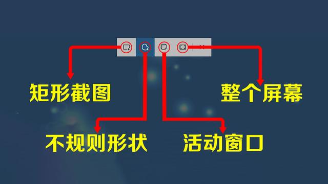
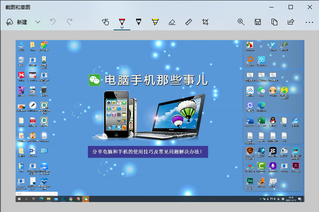
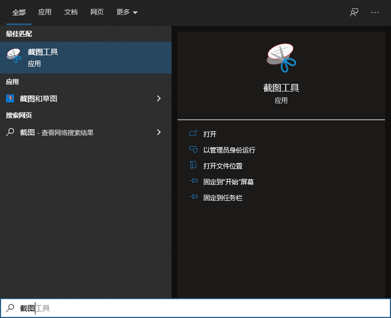
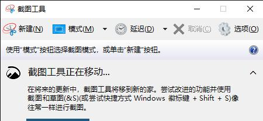

# 本人觉得可以使用键盘比较友好的操作相应的功能如下

### `tips:不熟悉会在加（）备注`

### ★按Windows：显示或隐藏 “开始”功能表
*   Windows+D：显示桌面
*   Windows+M：最小化所有窗口
*   Windows+Shift+M：还原最小化的窗口
*   Windows+E：开启“资源管理器”
*   Windows+F：查找文件或文件夹
*   Windows+R：开启“运行” 对话框
*   Windows+U：开启 “公用程序管理器”（win10打开的是设置的第一个设置页面）
*   Windows+L：切换使用者(Windows XP新功能，win10也是进入到切换用户模式)

###  ★Ctrl快捷键
*   Ctrl+S 保存
*   Ctrl+W 关闭程序
*   Ctrl+N 新建
*   Ctrl+O 打开
*   Ctrl+Z 撤销
*   Ctrl+F 查找
*   Ctrl+X 剪切
*   Ctrl+C 复制
*   Ctrl+V 粘贴
*   Ctrl+A 全选
*   Ctrl+Shift 输入法切换
*   Ctrl+空格 中英文切换
*   Ctrl+Home 光标快速移到文件头（Vscode里面好用的功能，试了下文本编辑应该都可以用）
*   Ctrl+End 光标快速移到文件尾（Vscode里面好用的功能，试了下文本编辑应该都可以用）
*   Ctrl+Esc 显示开始菜单
*   Ctrl+Shift+< 快速缩小文字
*   Ctrl+Shift+> 快速放大文字
*   Ctrl+拖动文件 复制文件
*   拖动文件时按住Ctrl+Shift 创建快捷方式（这个好用）

### ★Alt快捷键
####  Alt+空格 系列
*   Alt+空格+C 关闭窗口（试了下应该等同于 alt + F4）
*   Alt+空格+N 最小化当前窗口
*   Alt+空格+R 恢复最小化窗口
*   Alt+空格+X 最大化当前窗口
*   Alt+空格+S 改变窗口大小
#### 其他
*   Alt+F4 关闭当前程序
*   Alt+Tab 两个程序交换
*   Alt+F 打开文件菜单（Vscode可用，其他按键可用使用alt + 上方菜单）
*   Alt+E 打开编辑菜单（Vscode可用，其他按键可用使用alt + 上方菜单）

### ★Shift快捷键
*   Shift+右击 右菜单打开方式
*   Shift+F10 选中文件的右菜单(用的很少)
*   Shift+多级文件 全部关闭
*   Shift+Del 直接删除文件
*   Shift+^ 处在中文标点符号半角在智能ABC中省曰号（……）
*   Shift+ 处在中文标点符号半角在智能ABC中顿号（标点符号如：/*-+！@#￥%……&*（）——+《》？{}：“）

[Windows10系统最实用的6种截图方法，含快捷键，你学会了几种？](https://baijiahao.baidu.com/s?id=1716843655749720890&wfr=spider&for=pc)
### 方法1、快捷键PrintScreen
这个快捷键是Windows系统中通用的截图方法，只需直接按下键盘右上角的【PrintScreen】按键即可快速截取当前屏幕中的所有内容到剪切板。

这种方法截图之后并不会将画面保存到电脑中，而是暂时存储在剪切板中。只要打开Word、PS、画板等支持图片处理的应用软件，就可以直接通过Ctrl+V粘贴后进行编辑。

### 方法2、快捷键Win+PrintScreen
这个快捷键的最大好处是，它可以截取当前屏幕上的所有画面并且以图片的形式保存在电脑的硬盘中，以方便用户随时查看。

在默认情况，通过快捷键Win+PrintScreen截取的图片都是保存在了电脑的【图片->屏幕截图】文件夹下，并且以“屏幕截图”作为文件的名称。

### 方法4、快捷键Win+Shift+S
按下这个快捷键后，屏幕会变成半透明的灰色，然后出现一个可以操控的小窗口。这里有4种不同的截图方式，分别是矩形截图、不规则形状截图、活动窗口截图和整个屏幕截图，用户可以根据自己的实际需求选择相应的截图模式。

利用这种方式截图之后并不会生成图片文件，而是将截图的内容保存在剪切板中，需要通过Ctrl+V粘贴到其它图片编辑软件后进行处理。

### 方法5、快捷键Win+W
按下这个快捷键之后，在电脑屏幕的右下角会弹出一个小窗口，直接点击“全屏截图”即可截取整个屏幕的画面。

同时，它会启动“截图和草图”的应用程序并自动导入刚刚的截图画面，方便用户进行编辑。

### 方法6、Win10自带截图工具
在Windows 10系统中自带了一个不错的截图工具，可以通过下面的操作打开。

按下快捷键Ctrl+S打开Windows 10的搜索界面，并输入“截图”二字，从搜索结果中点击“截图工具”即可进入。

在这个截图工具中也集成了多种截图模式，如矩形截图、不规则形状截图、活动窗口截图和整个屏幕截图等，大家可以根据自己的需求选择适合自己的方式。  

